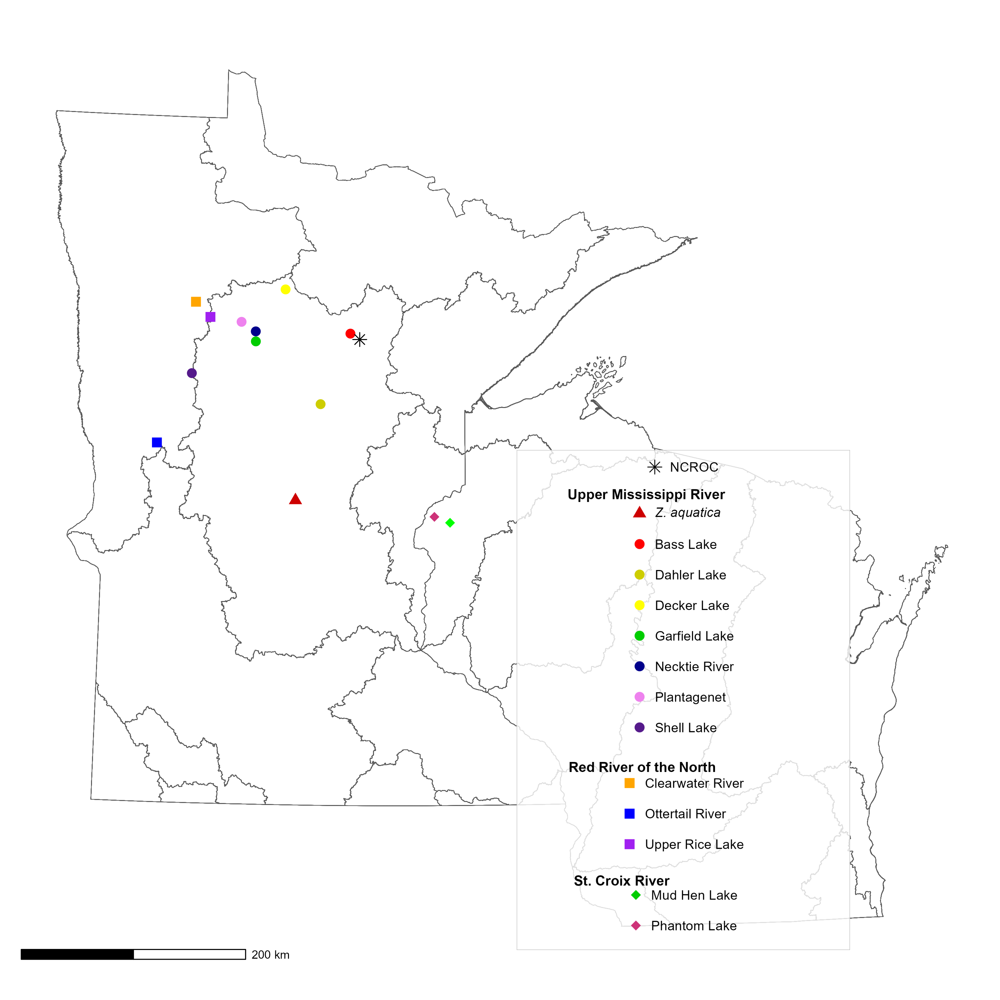
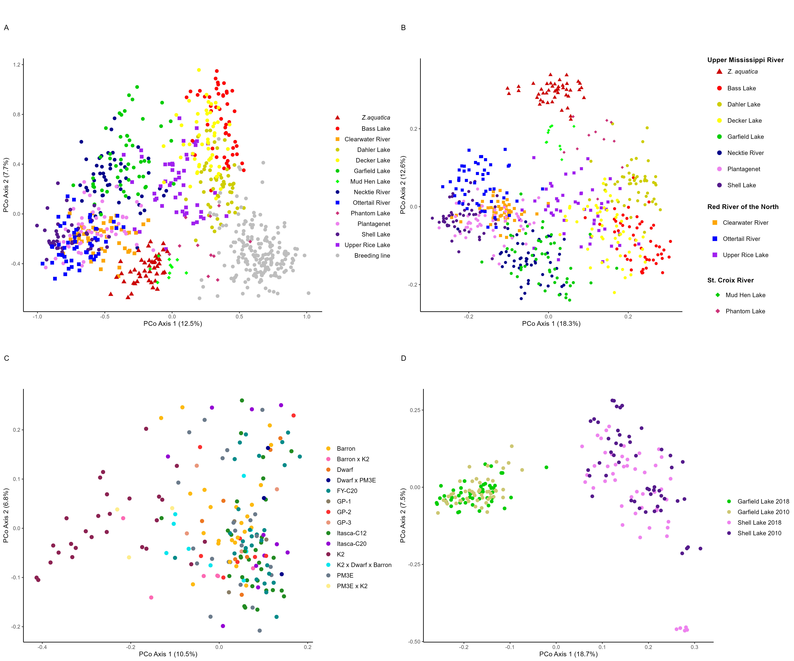
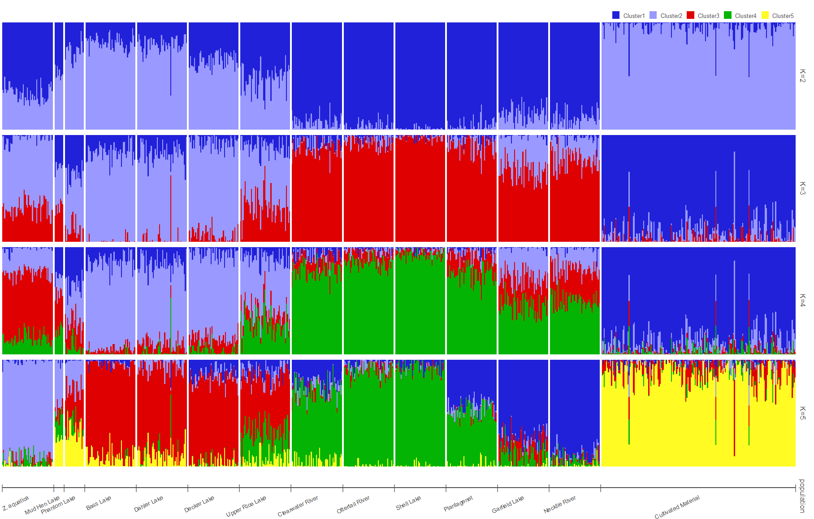
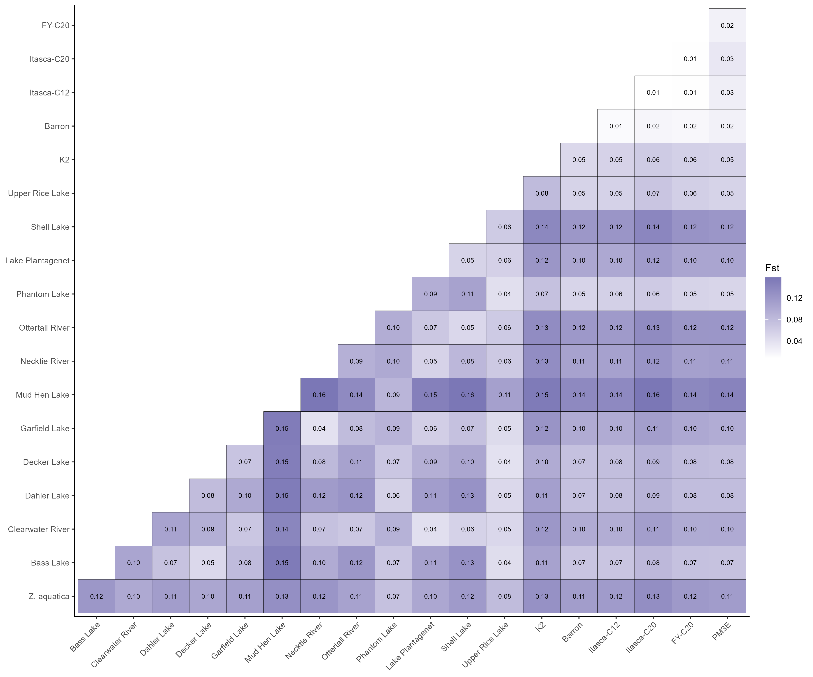
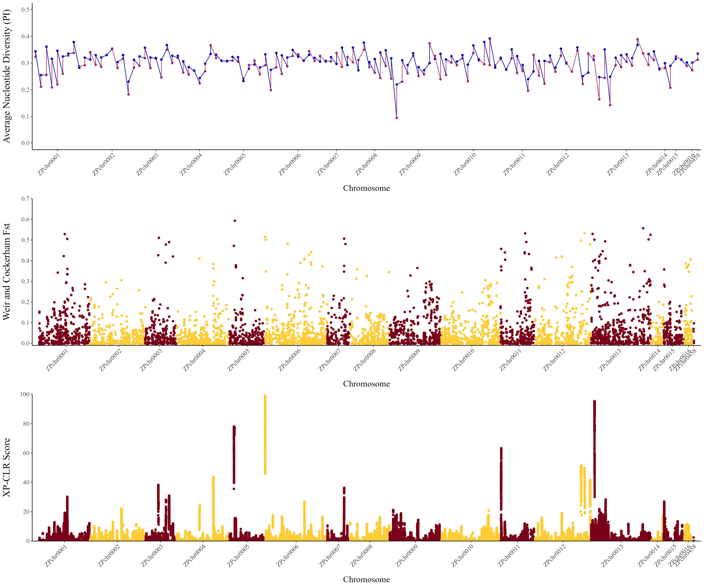

<h1 align="center"><strong>Genetic Analysis of Wild and Cultivated Populations of Northern Wild Rice (<I>Zizania palustris</I> L.) Reveal New Insights into Gene Flow and Domestication</strong></h1>

This repository contains all of the scripts that were developed for the Northern Wild Rice genetic diversity project. The pre-print can be found [here](https://www.biorxiv.org/content/10.1101/2022.08.25.505308v1). This work builds upon the initial pilot GBS study by [Shao _et al._ (2020)](https://link.springer.com/content/pdf/10.1007/s12686-019-01116-9.pdf).

# Directory
The purpose of this directory is to easily navigate to specific figures from the manuscript so that you can more easily find detailed information about the scripts that went into creating each figure.

## Figures
1. [Figure 1](#Figure-1)
2. [Figure 2](#Figure-2)
5. [Figure 3](#Figure-3)
6. [Figure 4](#Figure-4)
9. [Figure 5](#Figure-5)


## Tables
1. [Table 1](#Table-1)
2. [Table 2](#Table-2)
3. [Table S1](#Table-S1)
4. [Table S2](#Table-S2)
5. [Table S3](#Table-S3)
6. [Table S4](#Table-S4)
7. [Table S5](#Table-S5)
8. [Table S6](#Table-S6)
9. [Table S7](#Table-S7)

## Supplemental Figures
1. [Figure S1](#Figure-S1)
2. [Figure S2](#Figure-S2)
3. [Figure S3](#Figure-S3)
4. [Figure S4](#Figure-S4)
5. [Figure S5](#Figure-S5)
6. [Figure S6](#Figure-S6)
7. [Figure S7](#Figure-S7)
8. [Figure S8](#Figure-S8)
9. [Figure S9](#Figure-S9)

The goal of each of these pipelines was to generate a Variant Call Format (VCF) file containing SNP data for our population to be used in further analysis.

The directory [pop_gen_analyses](pop_gen_analyses) contains scripts used to conduct many of the population genetic analyses for this project.

**Genome stats:**<br>
The script [merge_fastq_read_counts.py](Quality_Checks/merge_fastq_read_counts.py) was used to merge the fastq read counts from each of the reports from two sequening runs [file 1](Quality_Checks/190730_A00223_0174_BHCN5GDRXX_metrics.csv) and [file 2](Quality_Checks/190819_A00223_0191_AHF3V3DRXX_metrics.csv) and sum them based on sample identity. The average read count from the FASTQC report (this one run by the University of Minnesota Genomics Center) was 2.1 million reads/sample. I used the [CSV output file](Quality_Checks/merged_fastq_sequence_counts.csv) from this script to reaffirm the average count of 2.1 million reads/sample and to find the total read count (1.8 billion reads for 873 samples). We filtered out some samples which were included in the sequencing run, but which were not part of the diversity study. This was done in Excel using the ```VLOOKUP()``` function on the [sample key](Sample_Keys/191021_main_GBS_sample_key_PBML-C20_renamed.csv).

# Figures
### Figure 1
This figure shows the location of collection sites on public, non-tribal land in Minnesota and Wisconsin. The original map (featuring only the Minnesota watersheds) used watershed boundaries provided by the Minnesota Department of Natural Resources. The updated watershed map featuring watersheds of both Minnesota and Wisconsin was provided by the Wisconsin Department of Natural Resources. **Note:** Shape files can be downloaded from https://www.census.gov/geographies/mapping-files/time-series/geo/carto-boundary-file.html. The code for producing this figure as well as figure S1 is found in [Figure1_and_S1_maps.Rmd](Map_Figures/Figure1_and_S1_maps.R). In order for this code to work you must have both the shape files (.shp) and shape index files (.shx) in your directory. 



### Figure 2
## Figure 2 code explanation
The PCoAs were calculated separately for all data, just cultivated, just natural stand, and just temporal data as described in the text files [All_data_PCoA.R](/pop_gen_analyses/PCoA/All_data_PCoA.R), [PCOA_cultivated_and_natural_separate.R](/pop_gen_analyses/PCoA/PCOA_cultivated_and_natural_separate.R), and [PCoA_Temporal.txt](/pop_gen_analyses/PCoA/PCoA_Temporal.txt), respectively. They were then each plotted using the script [PCoA_plotting.R](/pop_gen_analyses/PCoA/PCoA_plotting.R). Sample Keys use in these analyses can be found in the [Sample_Keys](Sample_Keys) directory. 

Principal component analysis plot (PC1 vs PC2) for the complete set<br>



### Figure 3
## Figure 3 code explanation
Data for this figure as well as figure S4 were organized for input into structure in the script [Organize_data_forStructure.R](pop_gen_analyses/STRUCTURE/Organize_data_forStructure.R). Data was then run through STRUCTURE using the parameters described in that script. As multiple runs of each K value were conducted, runs for each K value were aligned as described in the script [Aligning STRUCTURE runs within K values](pop_gen_analyses/STRUCTURE/Align_STRUCTURE_runs_within_Kvals.txt). Merged runs were then plotted with pophelper as described in the script [pophelper_plotting.R](pop_gen_analyses/STRUCTURE/pophelper_plotting.R)



### Figure 4
For this analysis a filtered VCF was generated that included all natural stand populations and only cultivated varieties (excluding other cultivated germplasm) in the script [Make_filteredVCF_andgenlight_forFST](pop_gen_analyses/Fst_WeirCockerham/Make_filteredVCF_andgenlight_forFST). The FST values were calculated with the [stAMPP](https://cran.r-project.org/web/packages/StAMPP/index.html) package in the [Calculate_Fst_full.R](pop_gen_analyses/Fst_WeirCockerham/Calculate_Fst_full.R) script. 



### Figure 5
The combined sweep plot was generated using [Figure 5.R](pop_gen_analyses/nucleotide_diversity/Figure_5.R) which imports data from each individual component's analysis so that they can be plotted in the same figure. The average nucleotide diversity (pi) was calculated in the script [Calculate_natandcult_nucleotidediv.sh](pop_gen_analyses/nucleotide_diversity/Calculate_natandcult_nucleotidediv.sh) and organized for plotting with the script [calculate_genome-wide_nucleotide_diversity.R](pop_gen_analyses/nucleotide_diversity/calculate_genome-wide_nucleotide_diversity.R). The genome-wide FST was calculated in the scirpt [calculate_Fst_vcftools_natural_stands_vs_cultivated_June_2022.sh](pop_gen_analyses/nucleotide_diversity/calculate_Fst_vcftools_natural_stands_vs_cultivated_June_2022.sh). XP-CLR was calcualted in the [run_xp-clr.sh](pop_gen_analyses/nucleotide_diversity/run_xp-clr.sh) script.



# Tables

### Table 1
Summary marker statistics for 5,955 Northern Wild Rice (NWR; Zizania palustris L.) bi-allelic single nucleotide polymorphism (SNP) markers generated via genotyping-by-sequencing (GBS). 
| Chr/Scaffold | Size (Mbp) | # of SNPs | % of total SNPs | # of SNPs in genic regions | % of SNPs in genic regions per chromosome |
| :----------- | ---------: | --------: | --------------: | -------------------------: | ----------------------------------------: |
| ZPchr0001    | 95.4       | 483       | 8.11%           | 74                         | 15.32%                                    |
| ZPchr0002    | 103.4      | 435       | 7.30%           | 56                         | 12.87%                                    |
| ZPchr0003    | 58.8       | 302       | 5.07%           | 37                         | 12.25%                                    |
| ZPchr0004    | 98.7       | 491       | 8.25%           | 24                         | 4.89%                                     |
| ZPchr0005    | 66.6       | 350       | 5.88%           | 41                         | 11.71%                                    |
| ZPchr0006    | 118.0      | 598       | 10.04%          | 126                        | 21.07%                                    |
| ZPchr0007    | 42.6       | 181       | 3.04%           | 66                         | 36.46%                                    |
| ZPchr0008    | 75.7       | 367       | 6.16%           | 38                         | 10.35%                                    |
| ZPchr0009    | 95.1       | 481       | 8.08%           | 25                         | 5.20%                                     |
| ZPchr0010    | 111.4      | 568       | 9.54%           | 75                         | 13.20%                                    |
| ZPchr0011    | 63.2       | 285       | 4.76%           | 41                         | 14.39%                                    |
| ZPchr0012    | 105.9      | 410       | 6.88%           | 86                         | 20.98%                                    |
| ZPchr0013    | 111.3      | 583       | 9.79%           | 66                         | 11.32%                                    |
| ZPchr0014    | 24.0       | 91        | 1.53%           | 28                         | 30.77%                                    |
| ZPchr0015    | 39.1       | 237       | 3.98%           | 12                         | 5.06%                                     |
| ZPchr0016    | 13.8       | 88        | 1.48%           | 6                          | 6.82%                                     |
| ZPchr0458    | 4.3        | 5         | 0.08%           | 3                          | 60.00%                                    |

The number of genes that reside in genic regions are explained in the README file for the `count_snps_in_genes` directory, but I will also briefly explain the process/logic here. The script [bedtools_find_snps_in_genes.sh](count_snps_in_genes/bedtools_find_snps_in_genes.sh) uses the [`bedtools intersect`](https://bedtools.readthedocs.io/en/latest/content/tools/intersect.html) function to find which of my SNPs (in a VCF file) are located in genes (via the GFF3 file). The results are then written to another VCF file (`snps_in_genes.vcf`). A quick one-liner can be used to count the number of SNPS in genes on each chromosome:<br>
```bash
grep -v "^#" snps_in_genes.vcf | cut -f 1 | sort | uniq -c
```

### Table 2
Analysis of Molecular Variance (AMOVA). The AMOVA was performed using the [AMOVA.R](pop_gen_analyses/AMOVA/AMOVA.R) R script launched by [run_AMOVA.sh](pop_gen_analyses/AMOVA/run_AMOVA.sh). The Cultivated vs. Cultivated was re-run in the script [AMOVA_cultvcult.Rmd](pop_gen_analyses/AMOVA/AMOVA_cultvcult.Rmd) as the number of samples had to be adjusted after the initial calculation. 

| Grouping | Source of variation | df | MS | Sigma | % | Probability |
| :--- | :--- | ---: | ---: | ---: | ---: | ---: |
| Natural stands vs. Natural stands | Variations between individuals | 12 | 7440.64 | 133.71 | 8.10 | 0.001 |
|                                   | Variations within individuals  | 567 | 1516.08 | 1516.08 | 91.90 | 0.001 |
|                                   | Total variation                | 579 | 1638.87 | 1649.78 | 100.00 | 0.001 |
| Cultivated vs. Cultivated         | Variations between individuals | 13  | 1592.63  | 18.31   | 1.33 | 0.001 |
|                                   | Variations within individuals  | 172 | 1360.34 | 1360.34 | 98.67 | 0.001 |
|                                   | Total variation                | 185 | 1376.66 | 1378.65 | 100.00 | 0.001 |
| Natural stands vs. Cultivated     | Variations between individuals | 1 | 20,955.05 | 68.42 | 4.09 | 0.001 |
|                                   | Variations within indiviuduals | 765 | 1604.18 | 1604.17 | 95.91 | 0.001 |
|                                   | Total variation                | 766 | 1629.44 | 1672.60 | 100.00 | 0.001 |
| STRUCTURE grouping _K_ = 5        | Variations between individuals | 5 | 8508.68 | 57.96 | 3.53 | 0.001 |
|                                   | Variations within individuals  | 761 | 1584.24 | 1584.24 | 96.47 | 0.001 |
|                                   | Total variation                | 766 | 1629.44 | 1642.20 | 100.00 | 0.001 |


### Table S1
List of samples in our diversity collection of Northern Wild Rice (NWR; _Zizania palustris_ L.) genotyped with 5,955 single nucleotide polymorphism (SNP) markers generated via genotyping-by-sequencing (GBS). HUC 8 watershed designations include Upper Mississippi River (UMR), Red River of the North (RRN), and St. Croix River (SCR) basins.
| Sample ID | # of Samples | Collection Type | GPS coordinates | Watershed |
| :---      | :---:    | :---:           | :---:           | :---:     |
| Bass Lake | 50 | Natural Stand | 47.28716 - 93.63132 | UMR |
| Clearwater River | 50 | Natural Stand | 47.51838 - 95.46291 | RRN |
| Dahler Lake | 50 | Natural Stand | 46.71888 - 93.97281 | UMR |
| Decker Lake | 50 | Natural Stand | 47.63515 - 94.40492 | UMR |
| Garfield Lake | 50 | Natural Stand/Temporal | 47.21361 - 94.74380 | UMR |
| Mud Hen Lake | 10 | Natural Stand | 45.77005 - 92.47173 | SCR |
| Necktie River | 50 | Natural Stand | 47.29363 - 94.74724 | UMR |
| Ottertail River | 50 | Natural Stand | 46.38005 - 95.86430 | RRN |
| Phantom Lake | 20 | Natural Stand | 45.81839 - 92.65074 | SCR |
| (Lake) Plantagenet | 50 | Natural Stand | 47.36758 - 94.91755 | UMR |
| Shell Lake | 50 | Natural Stands/Temporal | 46.94510 - 95.48486 | UMR |
| Upper Rice Lake | 50 | Natural Stand | 47.40030 - 95.28659 | RRN |
| _Zizania aquatica_ | 50 | Natural Stand | 45.94473 - 94.24821 | UMR |
| Garfield Lake 2010 | 50 | Temporal | 47.21361 - 94.74380 | UMR |
| Shell Lake 2010 | 50 | Temporal | 46.94510 - 95.48486 | UMR |
| 14PD-C10 | 2 | Cultivated | n/a | n/a |
| 14S\*PM3/PBM-C3 | 3 | Cultivated | n/a | n/a |
| 14S\*PS-C3 | 5 | Cultivated | n/a | n/a |
| Barron | 25 | Cultivated | n/a | n/a |
| Itasca-C12 (Dovetail) | 15 | Cultivated | n/a | n/a |
| Itasca-C12 | 31 | Cultivated | n/a | n/a |
| Itasca-C20 | 11 | Cultivated | n/a | n/a |
| FY-C20 | 29 | Cultivated | n/a | n/a |
| GPB/K2B-C2 | 3 | Cultivated | n/a | n/a |
| GPN-1.20 | 2 | Cultivated | n/a | n/a |
| GPP-1.20 | 6 | Cultivated | n/a | n/a |
| K2B-C16 | 20 | Cultivated | n/a | n/a |
| K2EFBP-C1 | 5 | Cultivated | n/a | n/a |
| KPVN-C4 | 4 | Cultivated | n/a | n/a |
| KSVN-C4 | 5 | Cultivated | n/a | n/a |
| PLaR-C20 | 4 | Cultivated | n/a | n/a |
| PM3/3\*PBM-C3 | 6 | Cultivated | n/a | n/a |
| PM3/7\*K2EF | 3 | Cultivated | n/a | n/a |
| PM3E | 17 | Cultivated | n/a | n/a |
| VE/2\*14WS/\*4K2EF | 2 | Cultivated | n/a | n/a |
| VN/3\*K2EF | 4 | Cultivated | n/a | n/a |

### Table S2
Geographic distance (km) matrix of US states of Minnesota and Wisconsin lakes and rivers where Northern Wild Rice (NWR; _Z. palustris_ L.) leaf tissue samples were collected along with watershed designations for the Upper Mississippi River (UMR), Red River of the North (RRN), and St. Croix River (SCR). Geographic distance was calculated in the [Mantel test script](pop_gen_analyses/Mantel_Test/Mantel_test_240216.Rmd) 
|Natural Population (Watershed) | _Z. aquatica_ | Bass Lake | Clearwater River | Dahler Lake | Decker Lake | Garfield Lake | Mud Hen Lake | Necktie River | Ottertail Lake | Phantom Lake | (Lake) Plantagenet | Shell Lake | Upper Rice Lake |
| :--- | ---: | ---: | ---: | ---: | ---: | ---: | ---: | ---: | ---: | ---: | ---: | ---: | ---: |
| _Z. aquatica_ (UMR) | | 156.7 | 198.2 | 88.7 | 188.6 | 146.3 | 139.1 | 154.9 | 133.7 | 124.6 | 166.4 | 146.3 | 180.4 |
| Bass Lake (UMR) | 156.7 | | 140.4 | 68.4 | 69.9 | 84.5 | 190.8 | 84.3 | 197.8 | 179.9 | 97.5 | 145.5 | 125.5 |
| Clearwater River (RRN) | 198.2 | 140.4 | | 143.7 | 80.5 | 64.0 | 300.2 | 59.4 | 130.3 | 286.3 | 44.4 | 63.8 | 18.7 |
| Dahler Lake (UMR) | 88.7 | 68.4 | 143.7 | | 107.1 | 80.4 | 156.6 | 86.9 | 149.6 | 142.8 | 101.7 | 117.9 | 125.2 |
| Decker Lake (UMR) | 188.6 | 69.9 | 80.5 | 107.1 | | 53.4 | 254.7 | 45.9 | 178.3 | 242.5 | 48.7 | 112.0 | 71.3 | 
| Garfield Lake (UMR) | 146.3 | 84.5 | 64.0 | 80.4 | 53.4 | | 236.9 | 8.9 | 126.1 | 223.2 | 21.6 | 63.6 | 45.9 | 
| Mud Hen Lake (SCR) | 139.1 | 190.8 | 300.2 | 156.6 | 254.7 | 236.9 | | 243.2 | 270.6 | 14.9 | 258.2 | 265.9 | 281.6 |
| Necktie River (UMR) | 154.9 | 84.3 | 59.4 | 86.9 | 45.9 | 8.9 | 243.2 | | 132.6 | 229.6 | 15.3 | 68.0 | 42.4 |
| Ottertail Lake (RRN) | 133.7 | 197.8 | 130.3 | 149.6 | 178.3 | 126.1 | 270.6 | 132.6 | | 255.8 | 131.4 | 69.3 | 121.8 |
| Phantom Lake (SCR) | 124.6 | 179.9 | 286.3 | 142.8 | 242.5 | 223.2 | 14.9 | 229.6 | 255.8 | | 244.5 | 251.2 | 267.7 |
| Lake Plantagenet (UMR) | 166.4 | 97.5 | 44.4 | 101.7 | 48.7 | 21.6 | 258.2 | 15.3 | 131.4 | 244.5 | | 63.7 | 28.1 |
| Shell Lake (UMR) | 146.3 | 145.5 | 63.8 | 117.9 | 112.0 | 63.6 | 265.9 | 68.0 | 69.3 | 251.2 | 63.7 | | 52.8 |
| Upper Rice Lake (RRN) | 180.4 | 125.5 | 18.7 | 125.2 | 71.3 | 45.9 | 281.6 | 42.4 | 121.8 | 267.6 | 28.1 | 52.8 | |

### Table S3
Table S3 is too large to generate here using Markdown, so you can find it as an Excel file [here](Sample_Keys/Full_Sample_Key_240122.xlsx).

### Table S4
The Transition/Transversion ratios were generated using the script [calculate_TsTv_vcftools.sh](vcftools_scripts_incl_nonbiallelic/calculate_TsTv_vcftools.sh). Additional details can be found within the directory containing the script.
<!---
Note: In order to get non-breaking white space in 'original scaffold name' and 'genome wide', I had to hold down the alt/option button on my Mac while typing the space. Otherwise the table looks ugly due to text wrapping for those columns. Other computer types like a PC may have different keystrokes to achieve same goal.
-->
| Statistic | ZPchr0001 | ZPchr0002 | ZPchr0003 | ZPchr0004 | ZPchr0005 | ZPchr0006 | ZPchr0007 | ZPchr0008 | ZPchr0009 | ZPchr0010 | ZPchr0011 | ZPchr0012 | ZPchr0013 | ZPchr0014 | ZPchr0015 | ZPchr0016 | ZPchr0458 | Genome wide
| :--- | ---: | ---: | ---: | ---: | ---: | ---: | ---: | ---: | ---: | ---: | ---: | ---: | ---: | ---: | ---: | ---: | ---: | ---: |
| Original scaffold name | Scaffold_13 | Scaffold_93 | Scaffold_3 | Scaffold_18 | Scaffold_1065 | Scaffold_48 | Scaffold_1063 | Scaffold_1062 | Scaffold_1 | Scaffold_70 | Scaffold_9 | Scaffold_415 | Scaffold_1064 | Scaffold_693 | Scaffold_7 | Scaffold_51 | Scaffold_453 | NA |
| Scaffold size (bp) | 95,470,783 | 103,377,072 | 58,865,324 | 98,769,966 | 66,616,710 | 118,006,097 | 42,614,780 | 75,690,682 | 95,187,837 | 111,429,323 | 63,217,741 | 105,879,435 | 111,260,184 | 24,058,870 | 39,125,943 | 13,817,767 | 4,333,358 | 1,227,721,872 |
| Number of SNPs | 483 | 435 | 302 | 491 | 350 | 598 | 181 | 367 | 481 | 568 | 285 | 410 | 583 | 91 | 237 | 88 | 5 | 5,955 |
| SNP density (SNPs/Mb) | 5.06 | 4.21 | 5.13 | 4.97 | 5.25 | 5.07 | 4.25 | 4.85 | 5.05 | 5.10 | 4.51 | 3.87 | 5.24 | 3.78 | 6.06 | 6.37 | 1.15 | 4.85 |
|  A/C | 40 | 33 | 30 | 38 | 17 | 60 | 23 | 29 | 44 | 49 | 21 | 25 | 43 | 7 | 15 | 6 | 0 | 480 |
| A/G | 169 | 171 | 108 | 205 | 147 | 197 | 57 | 128 | 181 | 213 | 109 | 149 | 234 | 30 | 92 | 40 | 2 | 2232 |
| A/T | 22 | 16 | 12 | 18 | 17 | 26 | 10 | 13 | 16 | 25 | 18 | 21 | 23 | 3 | 9 | 1 | 1 | 251 |
| C/G | 19 | 19 | 17 | 19 | 13 | 34 | 17 | 16 | 17 | 31 | 8 | 28 | 28 | 4 | 10 | 4 | 0 | 284 |
| C/T | 197 | 174 | 109 | 178 | 131 | 233 | 58 | 152 | 196 | 210 | 114 | 154 | 212 | 39 | 98 | 31 | 1 | 2287 |
| G/T | 36 | 22 | 26 | 33 | 25 | 48 | 16 | 29 | 27 | 40 | 15 | 33 | 43 | 8 | 13 | 6 | 1 | 421 |
| Transitions (Ts) | 366 | 345 | 217 | 383 | 278 | 430 | 115 | 280 | 377 | 423 | 223 | 303 | 446 | 69 | 190 | 71 | 3 | 4519 |
| Transversions (Tv) | 117 | 90 | 85 | 108 | 72 | 168 | 66 | 87 | 104 | 145 | 62 | 107 | 137 | 22 | 47 | 17 | 2 | 1436 |
| TsTv ratio | 3.13 | 3.83 | 2.55 | 3.55 | 3.86| 2.56 | 1.74 | 3.22 | 3.63 | 2.92 | 3.60 | 2.83 | 3.26 | 3.14 | 4.04 | 4.18 | 1.50 | 3.15 |

### Table S5
Polymorphic Information Content (PIC) values for 5,955 single nucleotide polymorphism (SNP) markers generated via genotyping-by-sequencing (GBS) using our diversity collection of Northern Wild Rice (NWR; _Zizania palustris_ L.)
| | Mean | Median | Minimum | Maximum | Standard Deviation |
| :--- | :---: | :---: | :---: | :---: | :---: |
| Barron | 0.1649 | 0.1557 | 0.0216 | 0.3125 | 0.1043 |
| FY-C20 | 0.1639 | 0.1557 | 0.0199 | 0.3125 | 0.1052 |
| Itasca-C12 | 0.1531 | 0.1379 | 0.0166 | 0.3125 | 0.1064 |
| Itasca-C20 | 0.1840 | 0.1829 | 0.0449 | 0.3125 | 0.0981 |
| K2EF-C16 | 0.1803 | 0.1829 | 0.0261 | 0.3125 | 0.1053 |
| PM3E | 0.1774 | 0.1829 | 0.0292 | 0.3125 | 0.1041 |
| | | | | | |
| Bass Lake | 0.1484 | 0.1287 | 0.0010 | 0.3125 | 0.1093 |
| Clearwater River | 0.1523 | 0.1369 | 0.0113 | 0.3125 | 0.1084 |
| Dahler Lake | 0.1541 | 0.1373 | 0.0142 | 0.3125 | 0.1079 |
| Decker Lake | 0.1540 | 0.1395 | 0.0091 | 0.3125 | 0.1111 |
| Garfield Lake | 0.1471 | 0.1263 | 0.0091 | 0.3125 | 0.1090 |
| Mud Hen Lake | 0.1924 | 0.1999 | 0.0493 | 0.3125 | 0.0982 |
| Necktie River | 0.1500 | 0.1260 | 0.0113 | 0.3125 | 0.1108 |
| Ottertail River | 0.1528 | 0.1353 | 0.0010 | 0.3125 | 0.1104 |
| Phantom Lake | 0.1637 | 0.1702 | 0.0248 | 0.3125 | 0.1049 |
| (Lake) Plantagenet | 0.1534 | 0.1353 | 0.0010 | 0.3125 | 0.1105 |
| Shell Lake | 0.1477 | 0.1221 | 0.0010 | 0.3125 | 0.1116 |
| Upper Rice Lake | 0.1420 | 0.1141 | 0.0010 | 0.3125 | 0.1088 |
| _Zizania aquatica_ | 0.1496 | 0.1313 | 0.0010 | 0.3125 | 0.1107 |

To calculate the Polymorphism Information Content (PIC) we used the [snpReady](https://cran.r-project.org/web/packages/snpReady/vignettes/snpReady-vignette.html) R package. [The Natural Stand calculation script](pop_gen_analyses/Diversity_Statistics/NeiD_and_PIC_with_snpReady.R) [Cultivated Calculation script](pop_gen_analyses/Diversity_Statistics/Neis_D_cultivated_with_snpReady.R).

### Table S6
_D_-statistics (ABBA-BABA) results for a diversity collection of Northern Wild Rice (NWR; _Zizania palustris_ L.).
| P1 | P2 | P3 | ABBA<sup>a</sup> | BABA<sup>a</sup> | BBAA<sup>a</sup> | D | p-value | F4-ratio | Z<sup>b</sup> |
| :---: | :---: | :---: |:---: | :---: | :---: | :---: | :---: | :---: | :---: |
| Cultivated | Natural Stands I | Natural Stands II | 348.181 | 336.828 | 367.406 | 0.017 | 0.098 | 0.193 | 1.655 |

<sup>a</sup> Number of ABBA and BABA sites. _Z. aquatica_ was used as an outgroup for all comparisons.<br>
<sup>b</sup> Z: Z-score

_D_-statistics (ABBA-BABA) was performed using the the R package [admixTools](https://github.com/DReichLab/AdmixTools) using the [admixtools_ABBA-BABA.R](pop_gen_analyses/ABBA-BABA/admixtools_ABBA-BABA.R) script 

### Table S7
Table S7 is too large to generate here using Markdown, so you can find it as an Excel file [here]([supplemental_data/Table_S7_significant_values_TajimaD_Fst_XP-CLR.xlsx](pop_gen_analyses/Genome-wide-selection/Table_S7_significant_values_TajimaD_Fst_XP-CLR.xlsx). Values were calculated in the following scripts: [TajimaD](), [Genome-wide Fst](pop_gen_analyses/Fst_WeirCockerham/plot_Fst_values_across_genome.R), [XP-CLR](pop_gen_analyses/Genome-wide-selection/plot_XP-CLR_results.R)

# Supplementary Figures

### Figure S1
. A county-level map of the United States of Minnesota and western Wisconsin showing where leaf tissue samples of our Northern Wild Rice (NWR; _Zizania palustris_ L.) diversity collection were collected and highlighting counties with significant production of cultivated NWR. Colors correspond to those featured in the principal component analysis (PCA) plots (Figure 2a-b).


### Figure S2
Unweighted pair group method with arithmetic averaging (UPGMA) tree for the combined Natural Stands and Cultivated Material panel. The first step in the pipeline to create the UPGMA trees is [run_bcftools_reheader.sh](pop_gen_analyses/trees/run_bcftools_reheader.sh) which makes a new VCF file with shortened sample names (e.g., only ```Sample_0001``` instead of ```Sample_0001/Sample_0001_sorted.bam```). The next step is to use [filter_with_vcftools_by_ind_natural_stands_and_breed_lines.sh](pop_gen_analyses/trees/filter_with_vcftools_by_ind_natural_stands_and_breed_lines.sh) in order to filter the complete VCF file (with all individuals) so that it only contains the samples that you want to include in the tree (specified by the ```.txt``` file (which also needs to contain the same individuals as the ```.csv``` file used by the R script otherwise you will get an error. The R script [make_tree_natural_stands_and_breeding_lines.R](pop_gen_analyses/trees/make_tree_natural_stands_and_breeding_lines.R) which is launched by [run_make_tree_natural_stands_and_breeding_lines.sh](pop_gen_analyses/trees/run_make_tree_natural_stands_and_breeding_lines.sh) contains the main code for making the figure (getting data into the right format, bootstrapping values, tip label color, etc).<br>

The default style for the UPGMA tree is `phyogram` according to the [_ape_ documentation](https://www.rdocumentation.org/packages/ape/versions/5.6-2/topics/plot.phylo). This is what we originally used, but I never liked how it appeared and I think the `fan` version is easier to interpret. It also makes the figure more compact, which I think helps in viewing the entire tree at once. The `radial` style is also circular, but I don't think it looks as clean as the `fan` style.<br><br>
Another new aspect of this tree vs. the original version is that the branches (or _edges_ using the _ape_ terminology) are colored to match the tip colors. This was acheived using the argument `edge.color = edge_colors` in the `plot.phylo()` function from the _ape_ R package. Together, the two changes described here are accomplished by executing this line of code:
```R
plot.phylo(tree, cex = 1.5, font = 2, adj = 0, type = "fan", edge.color = edge_colors, tip.color =  hexColorList[pop(gen_light_x)])
```
**Note:** This is very similar to the original code. The only difference is that in the original, the arguments `type = "fan"` and `edge.color = edge_colors` were not included so the function used their default values ("phylogram" for `type` and "black" for `edge.color`.)<br>

To add colors to the edges (branches), you should first initialize the "edge_colors" object. I did that using the following code:
```R
edge_colors <- rep("grey", Nedge(tree))
```
The `rep()` function will create an object that I've decided to call "edge_colors" with as many occurrences of the word "grey"  as there are edges (branches) in the `tree` object. The default is "black" as stated above, but in our combined PCA plot, we chose to make all of the cultivated material colored grey so that the natural stands would stick out. The approach we are using here (in combination with the next steps) will result in all of the cultivated material being colored grey without having to manually define each and every cultivated variety since there are a bunch of them with complex names (since some of the names offer insight into crosses that went into particular lines and aren't as simple as "Barron", "FY-C20", etc.).

I added lake/river-specific colors to the "edge_colors" object using the `which.edge()` function from the `ape` R packege. You can find documentation for that [here](https://rdrr.io/cran/ape/man/which.edge.html). The function returns a vector containing numbers matching the edges (branches) that meet a specific condition. Please see the line below for example code:<br>
```R
BassLake <- which.edge(tree, "Bass Lake")
```
The [script](pop_gen_analyses/trees/make_tree_natural_stands_and_breeding_lines.R) repeats this function for each individual lake or river.<br>

Colors are then added to the appropriate positions inside the "edge_colors" object using the following code:<br>
```R
edge_colors[BassLake] <- "red"
```
You will then repeat this step for each of the individual lakes/rivers like you did with the `which.edge()` function to insert the correct color that matches the collection map and PCA plots.

The resulting figure (from the `plot.phylo()` function above) will look like this:<br>


### Figure S3
The Evanno method (Evanno 2005) was carried out by uploading our results from STRUCTURE (Pritchard et al. 2000) into the program [STRUCTURE harvester](https://taylor0.biology.ucla.edu/structureHarvester/)(Earl and vonHoldt, 2012). DeltaK is minimized at K=5, suggesting that there are 5 subpopulations present in our diversity panel.There's no code to show for this figure because we simply uploaded data from STRUCTURE and uploaded it to this website.<br>


### Figure S4
Mantel test results. The plot shows the correlation between geographic distance (x-axis) and genetic distance (y-axis). Geographic distance (in kilometers) and genetic distance (as Prevosti's distance, also used in our UPGMA trees) were used as input. Units shown are not the same as the input units.<br>


The Mantel test was conducted in the R statistical environment using the [mantel_test.R](pop_gen_analyses/mantel_test.R) script. It contains the code for both the dot plot with regression line as well as the histogram of permutation testing. **Note:** Itasca-C12 was included to be representative of the Cultivated Material with the NCROC as its geographic coordinate to serve as a reference (since it is also the reference genome that was used for short read alignment and SNP calling) despite concerns that it is not a Natural Stand and may not be appropriate to incude (since it is subject to artificial selection and artificial planting and therefore not subject to natural evolutionary forces).

### Figure S5
Results of permutation testing. The histogram shows the frequency of simulated correlation tests resulting from permutation tests. The black diamond with a vertical line beneath it shows the actual correlation value from our Mantel (Figure S4) test using real data. This signifies that our results are unlikely to have been reached by chance.<br>


This histogram was created using the [mantel_test.R](pop_gen_analyses/mantel_test.R) script.

### Figure S6
Linkage disequilibrium decay for all chromosomes and scaffolds of Northern Wild Rice (NWR; _Zizania palustris_ L.) based on 5,955 single nucleotide polymorphism (SNP) markers generated via genotyping-by-sequencing (GBS).<br>


This plot was created using the [calculate_LD_decay.R](pop_gen_analyses/linkage_disequilibrium/calculate_LD_decay.R) script. This analysis used imputed data because the `LD.decay()` function from the [sommer](https://rdrr.io/cran/sommer/) R package requires no missing data. The first round of linkage disequilibrium analysis was done by Reneth in TASSEL and these results compare favorably with her results. The script that I used to recreate her TASSEL plots (in R) can be found [here](other_scripts/recreate_tassel_LD_plots.R). **Note:** They all have "_50slidingwindow.csv" as part of the filename.

### Figure S7
Site spectrum frequency histograms for our a.) Natural Stand collection and b.) Cultivated collection of Northern Wild Rice (NWR; _Zizania palustris_ L.) based on 5,955 single nucleotide polymorphism (SNP) markers generated via genotyping-by-sequencing (GBS).<br>


The figure was made using the [plot_site_spectrum_frequency.R](pop_gen_analyses/plot_site_spectrum_frequency.R) script. Calculations were done in Excel and can be found in the file **snp_matrices_with_SFS_calcs.xlsx**. I tried to link to it here, but the file size is too big (almost 70 Mb) so it is in our Google Drive and in our DRUM submissin. Briefly, the SNP matrix was arranged so that columns represent individuals (samples) and rows represent SNPs. Six colummns were added to the end of the SNP matrix (0=reference allele; 1=heterozygous; 2=alternate allele; NA=missing; Total=total number of individuals; Total_no_NA=total number of individuals with data). Two additional columns were added: ref_allele_freq and alt_allele_freq for reference allele frequency and alternate allele frequency, respectively. The reference allele frequency was calculated by adding $2\times ref count$ to the heterozygous count and dividing by _twice_ the total number of non-missing calls. Similarly, the alternate allele frequency was calculated by adding $2\times alt count$ to the heterozygous count and dividing by _twice_ the total number of non-missing calls. **Note:** we could also have done this by subtracting the ref allele count from 1, but this got us the same result. Also note that the reason we used twice the number of reference, alternate, and total counts is because NWR is a diploid organism  so each call represents two alleles and we are calculating _allele frequency_. We could also have reached the same result by keeping the reference, alternate, and total counts the same and only adding _half_ of the heterozygous counts to each calculation. We then counted the number of occurrences of each allele frequency in bins of 2 percent (e.g., 0.00-0.019, 0.02-0.039, 0.04-0.059, etc). _These_ numbers (calculated separately for Natural Stands and Cultivated Material) were hard-coded into the R script.

### Other scripts
#### Exploratory work
There are some other file preseent in this repository that didn't make it into the manuscript, but are here nonetheless. Rather than permanently remove them, the purpose of this section is to briefly explain what they were used for.
1. [plotting_dv-dp_ratios.R](exploratory_work/plotting_dv-dp_ratios.R) was used to look at the dv/dp (depth of the variant/total depth of a SNP) to confir that NWR is in fact a diploid. The ploidy was briefly called into question because the size of the genome assembly came in at 1.29 Gb, which is much larger than initially expected. The output of this script confirmed that NWR is indeed a diploid. Later, we also did flow cytometry and the result of that experiment showed that the true size of the NWR genome is closer to 1.8 Gb.
2. [plot_effect_of_hwe_on_Fst.R](exploratory_work/plot_effect_of_hwe_on_Fst.R) was used to explore how altering the Hardy-Weinberg Equilibrium filtering parameter in VCFtools affected the _Fst_ values. This was done because the _Fst_ values were considerably lower than expected based on previous literature. 
3. [plot_effect_of_mac_on_Fst.R](exploratory_work/plot_effect_of_mac_on_Fst.R) was used to explore how altering the minor allele frequency (or count) parameter in VCFtools affected the _Fst_ values. While altering this parameter had the greatest effect on _Fst_ values, changing them did not greatly affect the overall _Fst_ results.
